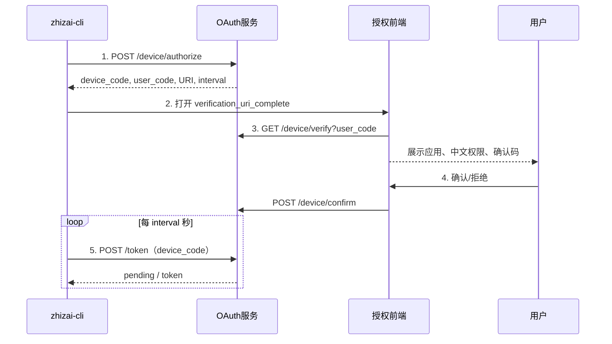

# zhizai-cli 设备授权认证接口文档

> 面向：`zhizai-cli` 开发者、授权前端开发者。  
> 范围：仅 OAuth 2.0 设备授权（Device Authorization）流程；不适用于 ticket、授权码回调或客户端凭证模式。

## 1. 接入概览

`zhizai-cli` 没有浏览器回调地址。CLI 创建一次短期设备授权会话，打开浏览器；用户登录、核对确认码并确认后，CLI 轮询 token 接口获得令牌。

`verification_uri` 由服务端配置项 `note.oauth2.device.verification-page-url` 提供，必须是授权前端可访问的公网 HTTPS 页面地址，例如 `https://openapi.zzjilu.com/oauth/device`；禁止根据当前请求的 Host 或内网服务地址动态拼接。



## 2. 通用约定

### 2.1 基础地址与响应格式

| 项目 | 说明 |
| --- | --- |
| 外部 OpenAPI 基础路径 | `https://openapi.zzjilu.com/api/v1`（按环境配置） |
| OAuth 基础路径 | `{openapi_base}/oauth2` |
| 请求格式 | `application/x-www-form-urlencoded`，除查询接口外 |
| 成功判断 | `resultCode = "0"` |
| 失败判断 | `resultCode != "0"`；不要只根据 HTTP 200 判断 |

```json
{
  "resultCode": "0",
  "resultMsg": "成功",
  "resultObject": {}
}
```

### 2.2 安全边界

- `device_code`、access token 和 refresh token 仅可由 `zhizai-cli` 本机保存；不能交给前端、Agent 宿主或日志。
- `user_code` 仅供用户在浏览器页面核对，不能用于换取 token。
- 前端确认时只能提交 `user_code` 和 `approved`；不得提交或信任 client、scope、用户 ID。
- CLI 收到成功 token 后应使用本机安全凭据存储，并在日志中脱敏。

## 3. CLI：创建设备授权会话

### 请求

```http
POST {openapi_base}/oauth2/device/authorize
Content-Type: application/x-www-form-urlencoded

client_id=zhizai_cli&scope=note.content.read%20note.kn.read
```

| 参数 | 必填 | 示例 | 说明 |
| --- | ---: | --- | --- |
| `client_id` | 是 | `zhizai_cli` | 已登记的 CLI 客户端 ID。 |
| `scope` | 否 | `note.content.read note.kn.read` | 空格分隔；未传时授予客户端全部已启用 scope。 |

### 成功响应

```json
{
  "resultCode": "0",
  "resultMsg": "成功",
  "resultObject": {
    "device_code": "gK0vH1r8bE6dX2mPz...",
    "user_code": "5PK3-RATU-7M9C",
    "verification_uri": "https://openapi.zzjilu.com/oauth/device",
    "verification_uri_complete": "https://openapi.zzjilu.com/oauth/device?user_code=5PK3-RATU",
    "expires_in": 600,
    "interval": 5
  }
}
```

| 返回字段 | 说明 |
| --- | --- |
| `device_code` | 高熵设备密钥；仅 CLI 保存并用于第 5 节。 |
| `user_code` | 用户核对码。 |
| `verification_uri` | 授权前端入口。 |
| `verification_uri_complete` | 带 `user_code` 的完整地址；CLI 优先打开它。 |
| `expires_in` | 本次会话有效期，单位秒。 |
| `interval` | 最小轮询间隔，单位秒。 |

### CLI 行为

1. 成功后立即打开 `verification_uri_complete`。
2. 打开失败时打印 `verification_uri` 和 `user_code`，等待用户手动完成浏览器确认。
3. 从请求结束起至少等待 `interval` 秒，再调用第 5 节接口。
4. 超过 `expires_in` 后停止轮询，重新创建会话。

## 4. 前端：读取确认页数据

### 请求

```http
GET {openapi_base}/oauth2/device/verify?user_code=5PK3-RATU
Authorization: Bearer {平台登录 token}
```

| 参数 | 位置 | 必填 | 说明 |
| --- | --- | ---: | --- |
| `user_code` | query | 是 | CLI 展示的确认码。 |

未登录用户先进入既有登录流程；登录完成后携带原 `user_code` 回到授权页。

### 成功响应

```json
{
  "resultCode": "0",
  "resultMsg": "成功",
  "resultObject": {
    "userCode": "5PK3-RATU",
    "clientName": "智在 CLI",
    "scopes": [
      {
        "scopeCode": "note.content.read",
        "accessMode": "READ",
        "scopeName": "读取笔记",
        "scopeDesc": "查看你的笔记内容与详情"
      },
      {
        "scopeCode": "note.kn.read",
        "accessMode": "READ",
        "scopeName": "查询知识库",
        "scopeDesc": "查询知识库与问答结果"
      }
    ],
    "expiresIn": 533
  }
}
```

### 前端展示要求

- 展示 `clientName`、`userCode`、每一项 `accessMode`、`scopeName` 与 `scopeDesc`、`expiresIn`；`READ` 显示为“读”，`WRITE` 显示为“写”。
- 确认码必须与 CLI 展示的值一致才建议用户确认。
- `expiresIn <= 0` 或接口失败时展示会话已过期，不能再调用确认接口。

### 无效授权请求

确认码不存在、已过期、已被用户确认（`APPROVED`）、已拒绝（`DENIED`）或已被 CLI 成功兑换（`CONSUMED`）时，接口返回：

```json
{
  "resultCode": "08-03-3-001-200012",
  "resultMsg": "无效的授权请求",
  "resultObject": null
}
```

前端收到该错误码时展示标题“无效的授权请求”，说明文字“该授权码无效或已过期，请重新发起授权。”，不再展示确认按钮。

## 5. 前端：确认或拒绝

### 请求

```http
POST {openapi_base}/oauth2/device/confirm
Content-Type: application/x-www-form-urlencoded
Authorization: Bearer {平台登录 token}

user_code=5PK3-RATU&approved=true
```

| 参数 | 必填 | 示例 | 说明 |
| --- | ---: | --- | --- |
| `user_code` | 是 | `5PK3-RATU` | 本次设备授权的确认码。 |
| `approved` | 是 | `true` | `true` 为确认，`false` 为拒绝。 |

### 成功响应

```json
{
  "resultCode": "0",
  "resultMsg": "成功",
  "resultObject": null
}
```

成功后前端显示“授权完成，可以关闭此页面回到智在 CLI”；拒绝后显示“已拒绝授权”。两种情况都不返回 token。

## 6. CLI：轮询换取 token

### 请求

```http
POST {openapi_base}/oauth2/token
Content-Type: application/x-www-form-urlencoded

grant_type=urn:ietf:params:oauth:grant-type:device_code&client_id=zhizai_cli&device_code={device_code}
```

| 参数 | 必填 | 示例 | 说明 |
| --- | ---: | --- | --- |
| `grant_type` | 是 | `urn:ietf:params:oauth:grant-type:device_code` | 固定值。 |
| `client_id` | 是 | `zhizai_cli` | 必须和第 3 节一致。 |
| `device_code` | 是 | `<仅CLI持有>` | 第 3 节获得的设备密钥。 |

### 成功响应

```json
{
  "resultCode": "0",
  "resultMsg": "成功",
  "resultObject": {
    "access_token": "eyJhbGciOiJIUzI1NiJ9...",
    "token_type": "Bearer",
    "expires_in": 3600,
    "refresh_token": "VSVDoV7XbA...",
    "scope": "note.content.read note.kn.read"
  }
}
```

| 返回字段 | 说明 |
| --- | --- |
| `access_token` | OpenAPI 调用令牌。 |
| `token_type` | 固定为 `Bearer`。 |
| `expires_in` | access token 有效期，秒。 |
| `refresh_token` | 刷新令牌；每次刷新后必须覆盖旧值。 |
| `scope` | 最终授予的 scope，空格分隔。 |

### 轮询失败返回与处理

```json
{
  "resultCode": "08-03-3-001-200001",
  "resultMsg": "用户尚未确认设备授权",
  "resultObject": null
}
```

| resultCode | 错误名称 | 含义 | CLI 处理 |
| --- | --- | --- | --- |
| `08-03-3-001-200001` | `OAUTH2_AUTHORIZATION_PENDING` | 用户尚未确认 | 等待 `interval` 秒后重试。 |
| `08-03-3-001-200002` | `OAUTH2_SLOW_DOWN` | 轮询过快 | 增加等待时间后重试。 |
| `08-03-3-001-200003` | `OAUTH2_ACCESS_DENIED` | 用户拒绝授权 | 停止登录。 |
| `08-03-3-001-200004` | `OAUTH2_EXPIRED_TOKEN` | 设备会话已过期 | 停止并回到第 3 节重新发起。 |
| `08-03-3-001-200005` | `OAUTH2_INVALID_GRANT` | device code、授权码无效或已被消费 | 停止并回到第 3 节重新发起。 |
| `08-03-3-001-200006` | `OAUTH2_INVALID_CLIENT` | 客户端不存在、已停用或密钥错误 | 停止登录并检查客户端配置。 |
| `08-03-3-001-200007` | `OAUTH2_UNAUTHORIZED_CLIENT` | 客户端不允许当前 grant_type | 停止登录并检查客户端授权模式。 |
| `08-03-3-001-200008` | `OAUTH2_INVALID_SCOPE` | 请求 scope 不在客户端授权范围内 | 调整请求 scope 后重新发起。 |
| `08-03-3-001-200009` | `OAUTH2_UNSUPPORTED_GRANT_TYPE` | grant_type 不受支持 | 停止登录并升级/修正 CLI。 |
| `08-03-3-001-200010` | `OAUTH2_INVALID_REQUEST` | 请求参数或授权码/PKCE 校验不符合要求 | 修正请求后重新发起。 |
| `08-03-3-001-200011` | `OAUTH2_SERVER_ERROR` | 服务端配置或未知错误 | 停止轮询，稍后重试或联系平台。 |

`resultCode` 是 `NoteErrorConstant` 定义的平台稳定错误码；CLI 必须以 `resultCode` 分支，`resultMsg` 仅用于展示诊断信息。

## 7. CLI：刷新令牌

```http
POST {openapi_base}/oauth2/token
Content-Type: application/x-www-form-urlencoded

grant_type=refresh_token&client_id=zhizai_cli&refresh_token={refresh_token}
```

响应与第 6 节成功响应一致。刷新令牌为轮换机制：收到成功响应后，CLI 必须先持久化新的 `refresh_token`，再丢弃旧值。

## 8. 调用 OpenAPI

```http
GET {openapi_base}/note/querySingleNoteDetail?noteId=123
X-OAuth2-Access-Token: Bearer {access_token}
```

OpenAPI 使用 `X-OAuth2-Access-Token`，不是 `Authorization`。服务端会校验 token、客户端状态和方法声明的 scope。
